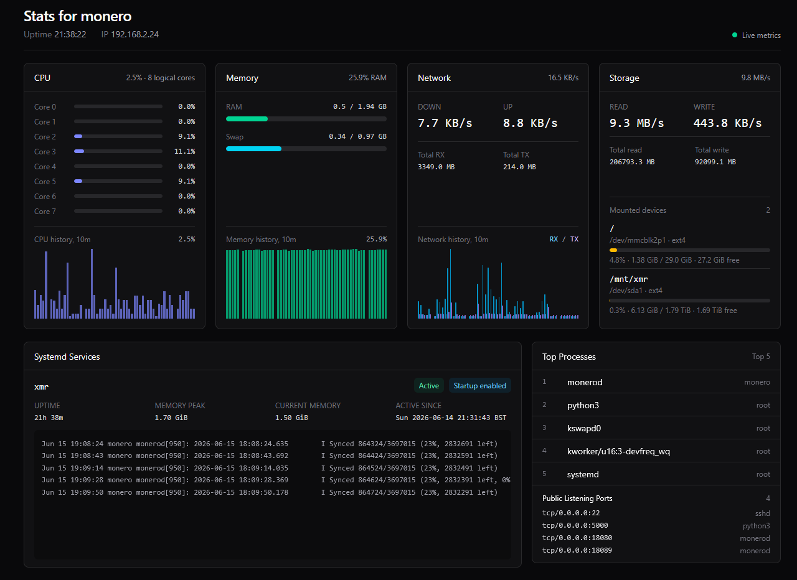

# System Dashboard

A lightweight Flask and HTMX dashboard for monitoring a Linux host from a browser. It is built for small servers, home lab machines, nodes, and services where you want a quick read on system health without installing a full observability stack.

The dashboard shows CPU, memory, network throughput, storage usage, disk I/O, selected systemd service state, recent service logs, and top resource-heavy processes. It stores short-term metric history locally in SQLite so the graphs remain useful across refreshes while keeping the setup simple and self-contained.



## Why Use It

- Quick browser-based view of a Linux machine
- No external database, agent, or hosted monitoring service required
- HTMX updates keep the dashboard live without full page reloads
- Useful for checking service health, resource usage, and recent logs in one place
- Small enough to run directly on the server it monitors

## Requirements

- Python 3.10+
- Linux with systemd for service status and journal output
- Access to `systemctl` and `journalctl`
- A modern browser

## Local Setup

Create and activate a virtual environment:

```bash
python3 -m venv .venv
source .venv/bin/activate
```

Install dependencies:

```bash
pip install -r requirements.txt
```

Run the app:

```bash
python app.py
```

Open:

```text
http://localhost:5000
```

## Configuration

Tracked services are configured in `src/config.py`:

```python
SERVICES_TO_TRACK = ["xmr"]
```

Update that list with the systemd unit names you want displayed.

Metric history is stored in a local SQLite database at `data/stats.sqlite3`.
The app keeps one sample every 10 seconds and deletes samples older than one day.

The SQLite database is ignored by Git so runtime metric data is not committed.

## Running With Gunicorn

For a production-style run from the project directory:

```bash
source .venv/bin/activate
gunicorn --workers 2 --bind 0.0.0.0:5000 app:app
```

## systemd Service

An example unit file is provided at `stats-dashboard.service.example`.

Copy it to systemd:

```bash
sudo cp stats-dashboard.service.example /etc/systemd/system/stats-dashboard.service
```

Edit these values in `/etc/systemd/system/stats-dashboard.service`:

```ini
User=your-user
Group=your-user
WorkingDirectory=/opt/stats
ExecStart=/opt/stats/.venv/bin/gunicorn --workers 2 --bind 0.0.0.0:5000 app:app
```

Then enable and start it:

```bash
sudo systemctl daemon-reload
sudo systemctl enable --now stats-dashboard
sudo systemctl status stats-dashboard
```

View logs:

```bash
sudo journalctl -u stats-dashboard -f
```
